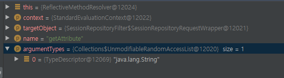

스프링이 SPEL을 파싱해서 실행해야할 메소드를 알아서 찾지만 진짜 어떻게 찾는지 궁금해서 따라가봄..<br/>
먼저 expression을 파싱한다.<br/>
파싱 결과를 `SpelNodes`의 트리로 변환한다.<br/>
`MethodReference`은 `SpelNode` 트리의 메소드 호출을 담당하는 부분이다. <br/>
`MethodReference`의 구현은 아래에서 일어난다.<br/>
`org.springframework.expression.spel.ast.MethodReference` 
`org.springframework.expression.spel.ast.MethodReference#getValueInternal(...)` 
`org.springframework.expression.spel.support.ReflectiveMethodExecutor`
그럼 `MethodReference`는 해당 target Class에서 원하는 method를 어떻게 찾을까??<br/>
`getValueInternal()`  메소드를 보자.
```java
	@Override
	public TypedValue getValueInternal(ExpressionState state) throws EvaluationException {
		EvaluationContext evaluationContext = state.getEvaluationContext();
		Object value = state.getActiveContextObject().getValue();
		TypeDescriptor targetType = state.getActiveContextObject().getTypeDescriptor();
		Object[] arguments = getArguments(state);
		TypedValue result = getValueInternal(evaluationContext, value, targetType, arguments);
		updateExitTypeDescriptor();
		return result;
	}

	private TypedValue getValueInternal(EvaluationContext evaluationContext,
			Object value, TypeDescriptor targetType, Object[] arguments) {

		List<TypeDescriptor> argumentTypes = getArgumentTypes(arguments);
		if (value == null) {
			throwIfNotNullSafe(argumentTypes);
			return TypedValue.NULL;
		}

		MethodExecutor executorToUse = getCachedExecutor(evaluationContext, value, targetType, argumentTypes);
		if (executorToUse != null) {
			try {
				return executorToUse.execute(evaluationContext, value, arguments);
			}
			catch (AccessException ex) {
				// Two reasons this can occur:
				// 1. the method invoked actually threw a real exception
				// 2. the method invoked was not passed the arguments it expected and
				//    has become 'stale'

				// In the first case we should not retry, in the second case we should see
				// if there is a better suited method.

				// To determine the situation, the AccessException will contain a cause.
				// If the cause is an InvocationTargetException, a user exception was
				// thrown inside the method. Otherwise the method could not be invoked.
				throwSimpleExceptionIfPossible(value, ex);

				// At this point we know it wasn't a user problem so worth a retry if a
				// better candidate can be found.
				this.cachedExecutor = null;
			}
		}

		// either there was no accessor or it no longer existed
		executorToUse = findAccessorForMethod(this.name, argumentTypes, value, evaluationContext);
		this.cachedExecutor = new CachedMethodExecutor(
				executorToUse, (value instanceof Class ? (Class<?>) value : null), targetType, argumentTypes);
		try {
			return executorToUse.execute(evaluationContext, value, arguments);
		}
		catch (AccessException ex) {
			// Same unwrapping exception handling as above in above catch block
			throwSimpleExceptionIfPossible(value, ex);
			throw new SpelEvaluationException(getStartPosition(), ex,
					SpelMessage.EXCEPTION_DURING_METHOD_INVOCATION, this.name,
					value.getClass().getName(), ex.getMessage());
		}
	}
```
`getValueInternal()`의 arg 정보는 아래와 같다.

 - targetType  <- 어떤 reflection으로 실행 시켜야할 메소드를 찾아야할 타켓 클래스 정보
 - arguments  <- 실행 시켜야할 메소드의 args

그 중 내가 실행시켜야할 메소드를 찾는 라인(만약 캐싱이 안되어있다면)은  아래 라인이다.
`executorToUse = findAccessorForMethod(this.name, argumentTypes, value, evaluationContext);`

```java
	private MethodExecutor findAccessorForMethod(String name, List<TypeDescriptor> argumentTypes,
			Object targetObject, EvaluationContext evaluationContext) throws SpelEvaluationException {

		List<MethodResolver> methodResolvers = evaluationContext.getMethodResolvers();
		if (methodResolvers != null) {
			for (MethodResolver methodResolver : methodResolvers) {
				try {
					MethodExecutor methodExecutor = methodResolver.resolve(
							evaluationContext, targetObject, name, argumentTypes);
					if (methodExecutor != null) {
						return methodExecutor;
					}
				}
				catch (AccessException ex) {
					throw new SpelEvaluationException(getStartPosition(), ex,
							SpelMessage.PROBLEM_LOCATING_METHOD, name, targetObject.getClass());
				}
			}
		}

		throw new SpelEvaluationException(getStartPosition(), SpelMessage.METHOD_NOT_FOUND,
				FormatHelper.formatMethodForMessage(name, argumentTypes),
				FormatHelper.formatClassNameForMessage(
						targetObject instanceof Class ? ((Class<?>) targetObject) : targetObject.getClass()));
	}
```
그 중에서도 `MethodExecutor methodExecutor = methodResolver.resolve(evaluationContext, targetObject, name, argumentTypes);`에서 실행시켜야할 method를 가져오는데 `methodResolver.resolve` 메소드와 넘어온 arg는 아래와 같다.

 - name <- 찾고자하는 메소드 네임
 - argumentTypes <- 파싱되서 넘어온 아규먼트의 타입들

코드가 장황하니 로직을 보면 대충 이렇다
1. 해당 클래스의 메소드 리스트를 가져온다.(순서 없음)
2. 아규먼트 타입의 길이에 따라 sort
3. bridge 해결
4. 중복 제거
5. loop를 돌며 `name`과 같은 메소드가 있는지 확인
6. 같은게 있으면 `argumentTypes`와 메소드의 파라미터의 타입들을 비교
7. 같으면 해당 메소드를 `ReflectiveMethodExecutor`로 리턴.
```java
	public MethodExecutor resolve(EvaluationContext context, Object targetObject, String name,
			List<TypeDescriptor> argumentTypes) throws AccessException {

		try {
			TypeConverter typeConverter = context.getTypeConverter();
			Class<?> type = (targetObject instanceof Class ? (Class<?>) targetObject : targetObject.getClass());
			List<Method> methods = new ArrayList<Method>(getMethods(type, targetObject));

			// If a filter is registered for this type, call it
			MethodFilter filter = (this.filters != null ? this.filters.get(type) : null);
			if (filter != null) {
				List<Method> filtered = filter.filter(methods);
				methods = (filtered instanceof ArrayList ? filtered : new ArrayList<Method>(filtered));
			}

			// Sort methods into a sensible order
			if (methods.size() > 1) {
				Collections.sort(methods, new Comparator<Method>() {
					@Override
					public int compare(Method m1, Method m2) {
						int m1pl = m1.getParameterTypes().length;
						int m2pl = m2.getParameterTypes().length;
						// varargs methods go last
						if (m1pl == m2pl) {
						    if (!m1.isVarArgs() && m2.isVarArgs()) {
						    	return -1;
						    }
						    else if (m1.isVarArgs() && !m2.isVarArgs()) {
						    	return 1;
						    }
						    else {
						    	return 0;
						    }
						}
						return (m1pl < m2pl ? -1 : (m1pl > m2pl ? 1 : 0));
					}
				});
			}

			// Resolve any bridge methods
			for (int i = 0; i < methods.size(); i++) {
				methods.set(i, BridgeMethodResolver.findBridgedMethod(methods.get(i)));
			}

			// Remove duplicate methods (possible due to resolved bridge methods)
			Set<Method> methodsToIterate = new LinkedHashSet<Method>(methods);

			Method closeMatch = null;
			int closeMatchDistance = Integer.MAX_VALUE;
			Method matchRequiringConversion = null;
			boolean multipleOptions = false;

			for (Method method : methodsToIterate) {
				if (method.getName().equals(name)) {
					Class<?>[] paramTypes = method.getParameterTypes();
					List<TypeDescriptor> paramDescriptors = new ArrayList<TypeDescriptor>(paramTypes.length);
					for (int i = 0; i < paramTypes.length; i++) {
						paramDescriptors.add(new TypeDescriptor(new MethodParameter(method, i)));
					}
					ReflectionHelper.ArgumentsMatchInfo matchInfo = null;
					if (method.isVarArgs() && argumentTypes.size() >= (paramTypes.length - 1)) {
						// *sigh* complicated
						matchInfo = ReflectionHelper.compareArgumentsVarargs(paramDescriptors, argumentTypes, typeConverter);
					}
					else if (paramTypes.length == argumentTypes.size()) {
						// Name and parameter number match, check the arguments
						matchInfo = ReflectionHelper.compareArguments(paramDescriptors, argumentTypes, typeConverter);
					}
					if (matchInfo != null) {
						if (matchInfo.isExactMatch()) {
							return new ReflectiveMethodExecutor(method);
						}
						else if (matchInfo.isCloseMatch()) {
							if (this.useDistance) {
								int matchDistance = ReflectionHelper.getTypeDifferenceWeight(paramDescriptors, argumentTypes);
								if (closeMatch == null || matchDistance < closeMatchDistance) {
									// This is a better match...
									closeMatch = method;
									closeMatchDistance = matchDistance;
								}
							}
							else {
								// Take this as a close match if there isn't one already
								if (closeMatch == null) {
									closeMatch = method;
								}
							}
						}
						else if (matchInfo.isMatchRequiringConversion()) {
							if (matchRequiringConversion != null) {
								multipleOptions = true;
							}
							matchRequiringConversion = method;
						}
					}
				}
			}
			if (closeMatch != null) {
				return new ReflectiveMethodExecutor(closeMatch);
			}
			else if (matchRequiringConversion != null) {
				if (multipleOptions) {
					throw new SpelEvaluationException(SpelMessage.MULTIPLE_POSSIBLE_METHODS, name);
				}
				return new ReflectiveMethodExecutor(matchRequiringConversion);
			}
			else {
				return null;
			}
		}
		catch (EvaluationException ex) {
			throw new AccessException("Failed to resolve method", ex);
		}
	}
```
## 주의할 점
잘 만들어진 코드지만 문제는 null이 arg로 넘어 오면 null은 어떤 타입으로든 convert되기 때문에 만약 overload된 메소드 리스트들이 있으면 어떤 녀석이 실행될지 몰라 원하는대로 동작이 안될 수 있다. 역시 null을 조심하자.
